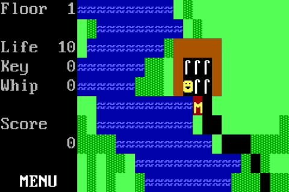

# WATER

Written in App Game Kit Classic (v1.7), ASCII Adventure: The Caves of ISNA was inspired by the [Korz series](https://en.wikipedia.org/wiki/Kroz) and released for iOS, Android, and Windows in 2012. It features 50+ levels of [roguelike/dungeon-crawler](https://en.wikipedia.org/wiki/Roguelike) gameplay. This respository contains source code for the Windows release, with keyboard-optimized gameplay.

## Screenshots

## License

This work is licensed under a
[Creative Commons Attribution-ShareAlike 4.0 International License][cc-by-sa].

[![CC BY-SA 4.0][cc-by-sa-image]][cc-by-sa]

[cc-by-sa]: http://creativecommons.org/licenses/by-sa/4.0/
[cc-by-sa-image]: https://licensebuttons.net/l/by-sa/4.0/88x31.png
[cc-by-sa-shield]: https://img.shields.io/badge/License-CC%20BY--SA%204.0-lightgrey.svg